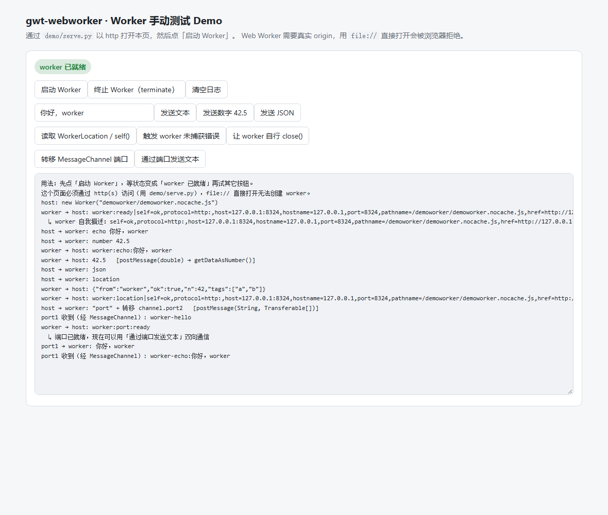

# gwt-webworker

WebWorker classes from Googles SpeedTracer extracted as own package to integrate in own projects.

Migrated to **GWT 2.13.1** / `org.gwtproject` coordinates / Java 11, and **100% JsInterop** - there is
no JSNI left anywhere in `src/` or `verify/`. See
[MIGRATION-GWT-2.13.md](MIGRATION-GWT-2.13.md) for the full migration record, compatibility matrix
and known risks.

**Since 4.0.0 the library's own code lives under `org.eostep.gwt.webworker`.** It used to sit in
`com.google.gwt.webworker`, which is a package namespace this project does not own; the move is
breaking, so it is a major version. The GWT module is renamed along with it - the `<inherits>` line
is now `org.eostep.gwt.webworker.WebWorker`. References to GWT's *own* packages
(`com.google.gwt.core`, `com.google.gwt.user`, `com.google.gwt.useragent`, `com.google.gwt.dom`,
`com.google.gwt.dev`, `com.google.gwt.http`) are unchanged.

## Maven integration

The dependency itself for GWT-Projects:

```xml
<dependency>
  <groupId>de.knightsoft-net</groupId>
  <artifactId>gwt-webworker</artifactId>
  <version>4.0.0</version>
</dependency>
```

This pulls `com.google.elemental2:elemental2-core` transitively (plus its own `elemental2-promise` /
`jsinterop-base` dependencies). Elemental2 is not optional here: the transfer-list parameters of the
`postMessage` family are typed `elemental2.core.JsArray<Transferable>`, because GWT's own
`com.google.gwt.core.client.JsArray` requires a `JavaScriptObject` type argument that a JsInterop
native type can never satisfy. Nothing needs to be declared by hand - Maven brings it in.

Your project must also depend on GWT itself. Since GWT 2.10 the coordinates are
`org.gwtproject`, not `com.google.gwt`:

```xml
<dependency>
  <groupId>org.gwtproject</groupId>
  <artifactId>gwt-user</artifactId>
  <version>2.13.1</version>
  <scope>provided</scope>
</dependency>
```

Because GWT compiles from *sources*, a GWT library has to put its `.java` files on your compiler
classpath. `mvn install` of this project attaches a `-sources.jar`; make sure your build uses it
(the GWT Maven plugins do this automatically).

## GWT integration

The project using web workers mustn't compile different permutations, because inside
a web worker the browser or language version can't be detected. So separate the web worker
from the rest of your application.

What you now have to insert into your `.gwt.xml` file is:

```xml
<inherits name='org.eostep.gwt.webworker.WebWorker' />

<set-property name="user.agent" value="safari" />
<set-configuration-property name="user.agent.runtimeWarning" value="false" />

<!-- Use the WebWorker linker for a Dedicated worker -->
<add-linker name="dedicatedworker" />
```

The module descriptor of this library inherits `com.google.gwt.useragent.UserAgent` so that the
`user.agent` property and the `user.agent.runtimeWarning` configuration property actually exist for
a worker module that inherits nothing else. Without that, the snippet above fails at compile time
with `Property 'user.agent' not found` - which is what happened on GWT 2.13 until this was fixed.

It also inherits `elemental2.core.Core`, which is what makes the transfer-list types in the
`postMessage` signatures resolvable. That comes along automatically with the `<inherits>` above.

As of GWT 2.13.1 `user.agent` has exactly two values, `gecko1_8` and `safari`; IE support was
dropped in GWT 2.10.0.

Now you can implement your Web Worker class which has to extend DedicatedWorkerEntryPoint
and implement MessageHandler. With postMessage(String) the Web Worker can send Messages to
the calling application and the onMessage(MessageEvent) method receives messages sent by the
application.

On application side you have to create one Error Handler and Message Handler to receive
Messages from the worker. Now you can create a Web Worker thread and post messages to him.
If you create more workers at the same time, you can use multithreading and take profit of
Multicore CPUs even in the browser.

```java
final ErrorHandler webWorkerErrorHandler = event -> {
  // handle error
};

final MessageHandler webWorkerMessageHandler = event -> {
  // handle message
};

Worker worker = Worker.create(<javascriptname>);
worker.setOnMessage(webWorkerMessageHandler);
worker.setOnError(webWorkerErrorHandler);

worker.postMessage("(may be serialized) data to handle in web worker");
```

That's all.

## Manual demo (open it in a browser)

`demo/` holds a two-module GWT demo you can click around in: a page with buttons that drive every
part of the library, and a worker compiled with the `dedicatedworker` linker.

There are two ways to run it, and they differ in what is live.

### Under GWT DevMode (Super Dev Mode) — the host is recompiled on every reload

```bash
mvn -o -DskipTests -Pgwt-demo-devmode install    # serves http://127.0.0.1:8888/ and opens it
```

Ctrl+C stops it. `-Dgwt.devmode.port=...` and `-Dgwt.devmode.codeServerPort=...` override the two
ports. Change anything under `demo/host/` and a browser reload picks it up — measured: editing the
status label produced `Job ..._1_2 ... Linking per-type JS with 21 new/changed types` in the code
server log and the new text on the next page load, with no Maven run and no restart.

**The worker is not live.** Super Dev Mode refuses any module whose linker is not a
`CrossSiteIFrameLinker` subclass, and a dedicated worker needs `DedicatedWorkerLinker`:

```
[ERROR] linkers other than CrossSiteIFrameLinker aren't supported.
        Found: org.eostep.gwt.webworker.linker.DedicatedWorkerLinker
```

So the profile compiles the worker once into the DevMode war directory and serves it as a static
file. Editing `demo/worker/` needs another run of the same command.

### From the linked build

```bash
mvn -o -DskipTests -Pgwt-demo package   # compiles both modules into target/gwt/demo
python demo/serve.py                    # serves it on http://127.0.0.1:8080 and opens a browser
```

`demo/serve.py --build` does both. `--port` and `--no-open` are there if you need them.



**Either way it has to be served over http.** A worker cannot be loaded from `file://` -
`new Worker("file:///...")` fails with *"Script at 'file:///...' cannot be accessed from origin
'null'"*. Double-clicking `index.html` will not work. (The linked route also needs `serve.py` to pin
`text/javascript` for `.js`, because Python's `mimetypes` reads the Windows registry and a
misconfigured one hands the GWT bootstrap to the browser as `text/plain`.)

What the buttons do:

| Button | What it proves |
|---|---|
| 启动 Worker | `Worker.create(url)` + `setOnMessage` / `setOnError` wiring; the worker's `ready` reply carries a self-description |
| 终止 Worker | `Worker.terminate()` |
| 发送文本 | string round trip host → worker → host (`postMessage(String)`) |
| 发送数字 42.5 | `postMessage(double)` out of the worker and `MessageEvent.getDataAsNumber()` on the host |
| 发送 JSON | `MessageEvent.getDataAsJSO()` parsing a real `JSON.parse` result |
| 读取 WorkerLocation / self() | all `WorkerLocation` accessors plus `self()`, read inside the worker |
| 触发 worker 未捕获错误 | a genuine uncaught `TypeError` raised outside GWT's `$entry` wrapper, surfaced by the host's `Worker.setOnError` with message / file / line |
| 让 worker 自行 close() | `DedicatedWorkerGlobalScope.close()`, deferred one turn so the reply is not lost |
| 转移 MessageChannel 端口 | the 3.0.0 transfer-list API: `worker.postMessage("port", new Transferable[] {channel.port2})` |
| 通过端口发送文本 | two-way traffic over the transferred port (`MessagePort.setOnMessage` / `postMessage`) |

The page also has an `#err-host` block that prints anything uncaught on the host side, because
compiled GWT otherwise swallows host exceptions and just leaves a half-built page. It stays empty
through the whole scripted run **except** during 「触发 worker 未捕获错误」, which raises an error on
purpose - measured 2026-09-28: run the other nine steps and the block is empty, add that one and the
same `TypeError` appears there as well as in the log's `Worker.setOnError` report.

One rule the host has to respect, because it is easy to get wrong and the failure is silent: the
library's two readers of a message payload (`getDataAsString()` / `getDataAsNumber()`) both map onto
the same JS `data` property and neither coerces, so **which one is correct depends on what the
worker actually sent, and that is a runtime fact**. `DemoHost` inspects the value instead of
predicting it - an earlier revision tracked a `expectNumber` flag meaning "the next message is the
number", which is wrong as soon as two requests are in flight: click 「发送文本」 and then
「发送数字 42.5」 and the two replies race, the flag mis-attributes them, and the number reaches
`getDataAsString()` where `.startsWith` does not exist.

This profile is separate from `gwt-verify` on purpose: `gwt-verify` asserts a machine-checked
verdict, this one produces a page for a human. Neither depends on the other.

The page has been checked in real Chromium under both routes: it renders the status label, all
eleven buttons and the log area, and a scripted run that clicks every button in order produces the
log described above. Under DevMode the host module is served by the code server
(`demohost/demohost.nocache.js` recompiled on demand) while the worker comes from the pre-built
static file, and the same full log appears.

## Verification harness

`verify/` contains a real end-to-end harness: a GWT module compiled with the `dedicatedworker`
linker that runs inside an actual worker, and a host module that drives it. It exists because this
library's own entry point is a no-op - GWT would prune every class and a green build would prove
nothing.

```bash
mvn -o -DskipTests -Pgwt-verify verify          # compiles both harness modules into target/gwt/www
python verify/run-e2e.py target/gwt/www 8311    # drives it in headless Chrome, prints the verdict
```

Last measured result: `VERDICT PASS`, 12/12 checks - worker bootstrap, message round-trip,
`WorkerGlobalScope.self()`, `getGlobalScope()`, every `WorkerLocation` accessor, `getDataAsJSO()`,
`postMessage(double)`/`getDataAsNumber()`, `ErrorEvent` on the host side, `close()`, and - since
3.0.0 - a real `MessageChannel` port transferred into the worker with
`worker.postMessage("port", new Transferable[] {channel.port2})` and posted back from inside the
worker. That last check is the only one that exercises the transfer-list overloads against real
browser objects; if the `Transferable[]`-to-JS-array reinterpretation were wrong the browser would
reject the call with a `TypeError` and the harness would never see the round trip.

## Interop model

Every class in the library is a JsInterop native type; there is no JSNI, and no
`JavaScriptObject` subclass, left in the project.

`MessagePort` was the last hold-out, and it was blocked by a hard generic bound rather than inertia:

```java
public class JsArray<T extends JavaScriptObject> { ... }   // com.google.gwt.core.client
```

`Worker`, `DedicatedWorkerGlobalScope` and `MessagePort` all declare a `postMessage` overload whose
transfer list used to be `JsArray<MessagePort>`. That type argument has to be a `JavaScriptObject`
subclass, and GWT rejects `@JsType(isNative = true)` on a class that extends `JavaScriptObject`
("Native JsType can only extend native JsType classes"), so `MessagePort` could not carry JsInterop
members while those signatures existed.

3.0.0 removes the bound instead of working around it: the transfer list is now
`elemental2.core.JsArray<Transferable>` - `elemental2.core.JsArray<T>` has no bound on `T`, and
`Transferable` is the marker interface the DOM spec actually names in
`postMessage(message, sequence<Transferable>)`. A Java `Transferable[]` overload is offered next to
it as an `@JsOverlay`, mirroring elemental2-dom's own idiom.

This is a **source-incompatible change** for anyone who touched those parameters; see the
compatibility matrix in [MIGRATION-GWT-2.13.md](MIGRATION-GWT-2.13.md#41-消费者视角).

## GWT compiler pitfalls found during this migration

Several of these cost real time and are worth knowing before touching the interop layer:

* **A body-less `native` method on a `JavaScriptObject` subclass crashes the compiler.** GWT
  treats it as an implicit JsInterop member; if it also needs a devirtualized static impl,
  `MakeCallsStatic.getOrCreateStaticImpl` dereferences the absent body and dies with
  `InternalCompilerException: Unexpected error during visit` (NPE in `JModVisitor.traverse`).
  Reproduced on GWT 2.12.2 and 2.13.1 with a three-line class. This is why `JsArrayString` in GWT
  itself writes `public final native String join(String separator) /*-{ ... }-*/` rather than a
  bare `native`, and it is the reason `MessagePort` had to keep JSNI bodies for as long as it was a
  `JavaScriptObject`. Since 3.0.0 no class in this project is a `JavaScriptObject` subclass, so the
  trap is out of reach here - but it still applies to any JSO overlay you write yourself.
* **A green GWT compile of this module proves nothing by itself.** The entry point is a no-op, so
  GWT's dead-code elimination removes the whole library before the compiler looks at it. Worse, an
  earlier revision of the harness wrote `if (port != null) { port.close(); }` with a local
  `port = null`, and the optimizer pruned `MessagePort` entirely - a green compile that had never
  seen the class. The harness now uses static fields plus a sink so nothing can be dropped.
* **`MessageEvent.getDataAsString()` does not coerce.** It maps straight onto the JS `data`
  property, exactly like the old JSNI `return this.data;`, so on a numeric payload it hands back a
  JS number and any `String` method on it throws `TypeError: ... startsWith is not a function`.
  This is preserved behaviour, not a regression - but it bites.
* **`Js.typeOf` does not resolve on GWT 2.13.1.** `jsinterop.base.Js.typeOf(Object)` is the obvious
  way to ask what a JS value is, the class file declares it, and the call still fails to compile:
  `The method typeOf(Object) is undefined for the type Js`. It is the one member of `Js` annotated
  `@JsMethod(namespace = "<window>")`, and `jsinterop-annotations` 2.0.0 renamed that namespace to
  `"<global>"`; `Js.debugger()`, `Js.isFalsy()`, `Js.isTruthy()`, `Js.coerceToDouble()`,
  `Js.isTripleEqual()` and `Js.uncheckedCast()` all resolve fine. `demo/` works around it with
  `Js.isTripleEqual(data, Js.coerceToDouble(data))` - see `DemoHost.isJsNumber`.
* **Super Dev Mode only accepts `CrossSiteIFrameLinker` and its subclasses.** Passing the demo's
  worker module to DevMode aborts the whole run before it binds a port:
  `linkers other than CrossSiteIFrameLinker aren't supported. Found: ...DedicatedWorkerLinker`. A
  worker module can therefore never be live-recompiled; keep it a pre-built static file and give
  DevMode the host module only. See the `gwt-demo-devmode` profile.
* **DevMode's `-workDir` must already exist.** `CodeServer.ensureWorkDir` only checks it and dies
  with `java.io.IOException: workspace directory doesn't exist` before any port is opened, which
  reads like a configuration problem rather than a missing directory. The GWT *compiler* creates its
  own `-workDir`, so this only bites the DevMode/code-server path.
* **`WorkerGlobalScope.close()` immediately discards the outbound queue.** A `postMessage` issued
  in the same turn as `close()` can be lost.

## Known defects left in place

These are documented, not fixed - 3.0.0 was kept a pure JSNI-to-JsInterop conversion so that
behaviour did not drift while the interop model changed underneath it:

| Member | Problem |
|---|---|
| `MessagePort.terminate()` | The DOM gives `MessagePort` no `terminate()`; the browser throws `TypeError`. `close()` is the correct call. |
| `DedicatedWorkerGlobalScope.terminate()` | Same - `DedicatedWorkerGlobalScope` has `close()`, not `terminate()`. |
| `MessageEvent.getSource()` | Declared to return `String`; the DOM says `MessageEventSource?` (a `WindowProxy` / `MessagePort` / `ServiceWorker`). A non-null value read through it is a JS object treated as a Java `String`. |
